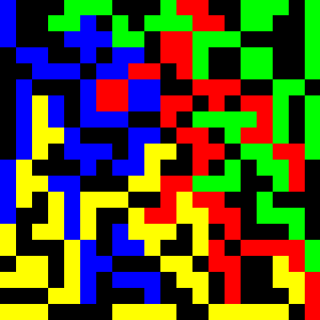

# blokus

### To Build

`$ make`

### Controls

_SPACE_ := place piece on board  
_C KEY_ := rotate piece  
_A KEY_ := reflect piece  
_P KEY_ := print piece to terminal (debugging)  
_Z KEY_ := swap piece (backwards)  
_X KEY_ := swap piece (forwards)  
_E KEY_ := end game (calculate scores, etc)  
